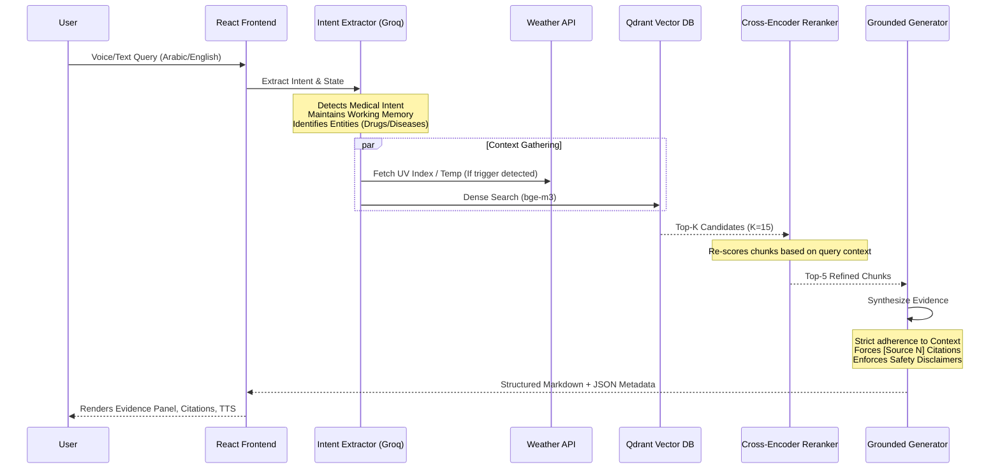

# MedLens AI: Clinical Decision Support RAG
**Core Philosophy:** *Fluent Answer ≠ Safe Answer.* Clinical recommendations must be grounded in official evidence, featuring explicit citations, transparent retrieval, and verified refusal logic.

## 🌟 Executive Summary
MedLens AI is a specialized Dermatology Retrieval-Augmented Generation (RAG) system built for the Egyptian demographic. It assists patients in understanding skin conditions (Eczema, Psoriasis, Urticaria) by synthesizing guidelines from official sources (NICE, WHO, local protocols) while strictly adhering to medical safety guardrails.

## 🏗️ System Architecture & Query Flow

The system is built as a highly modular, multi-layered pipeline ensuring each stage is testable and auditable.

## 🛠️ The 7-Layer RAG Pipeline

### 1. Ingestion & Chunking
- **Data Sourcing:** Official guidelines only (PDFs, Web Scrapes). No private/unverified data.
- **Section-Aware Chunking:** Text is split using semantic boundaries, preserving headers and hierarchical context.
- **Rich Metadata:** Every vector entry stores `document_name`, `source_url`, `drug_class`, and `section`.

### 2. Embeddings & Semantic Search
- **Multilingual Embeddings:** Powered by `BAAI/bge-m3` for superior Arabic-English cross-lingual retrieval.
- **Targeted Retrieval:** The intent extractor dynamically routes queries to specific Qdrant collections (e.g., searching `drugs` vs `diseases`).

### 3. Precision Reranking (Precision@K)
- **Cross-Encoder:** Uses `ms-marco-MiniLM-L-6-v2` to rerank retrieved chunks. This solves the "Lost in the Middle" problem and boosts `Precision@3` and `Precision@5` by scoring exact query-chunk relevance.

### 4. Safety & Guardrails Workflow
- **Input Guardrails (Intent Extractor):** Categorizes queries. Completely blocks chit-chat and out-of-scope non-medical queries. Flags voice inputs (`is_voice`) so the LLM tolerates STT misspellings without hallucinating.
- **Confidence Thresholding:** The LLM is explicitly instructed via System Prompt to output a standard refusal ("The retrieved sources do not provide enough information...") if the chunks lack answers.

### 5. Grounded Generation & Citation Mechanics
- The LLM acts **strictly as an evidence synthesizer, never a diagnostician.**
- Forces a structured 4-part response:
  1. Short Answer
  2. Evidence (Quoted from sources)
  3. Practical Recommendations (Self-care, properly cited)
  4. Safety & When to Seek Care
- Citations are tightly bound `[Source N]` and mapped to the exact metadata chunks.

### 6. Evidence Panel (Transparency UI)
- The frontend exposes a dedicated "Evidence Panel" mapping every `[Source N]` citation to the raw chunk text, its reranked confidence score, and the original URL. Users can audit the AI's logic instantly.

### 7. Accessibility & UX Excellence
- **STT (Speech-to-Text):** Integrated Whisper-v3 for accurate Arabic medical terminology transcription.
- **Karaoke-Style TTS (Text-to-Speech):** Utilizes Microsoft Edge Neural TTS with smart bilingual switching. Implements asynchronous chunked pre-fetching for instant audio playback (Zero TTFB latency) and dynamic word-by-word visual highlighting.

## 📊 Empirical Evaluation Results

The system was evaluated across RAGAS metrics, an adversarial Noise Robustness suite, and an LLM-as-a-Judge panel (GPT-class judge, 8 samples), all from actual measurement runs.

| Metric | Target | Measured | Status |
| :--- | :--- | :--- | :--- |
| **Faithfulness (RAGAS)** | > 0.95 | **1.0 (100%)** | ✅ Passed |
| **Noise Robustness** | > 0.95 | **1.0 (100%) — 20/20 cases** | ✅ Passed |
| **Context Precision (RAGAS)** | > 0.75 | **1.0 (100%)** | ✅ Passed |
| **Answer Relevance (RAGAS)** | > 0.80 | **0.834 (83.4%)** | ✅ Passed |
| **Reranker Precision@4 (Disease)** | Improve baseline | **+8.96% improvement** | ✅ Passed |
| **LLM-Judge: Medical Accuracy** | > 4.0/5.0 | **5.0 / 5.0** | ✅ Passed |
| **LLM-Judge: Groundedness** | > 4.0/5.0 | **5.0 / 5.0** | ✅ Passed |
| **LLM-Judge: Safety** | > 4.0/5.0 | **5.0 / 5.0** | ✅ Passed |
| **LLM-Judge: Helpfulness** | > 4.0/5.0 | **5.0 / 5.0** | ✅ Passed |
| **Time-To-First-Token (SSE)** | < 1s | **< 1s** | ✅ Passed |

> The 100% Noise Robustness was achieved by testing against 20 adversarial cases with plausible-but-fabricated medical context injected directly into the retrieval stream. The system abstained or issued safe refusals in all cases.
