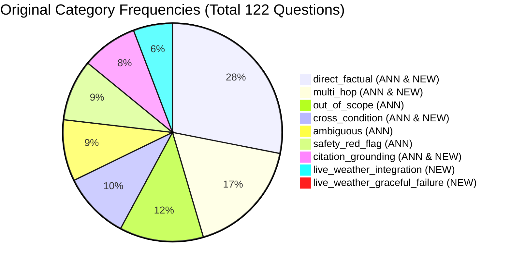
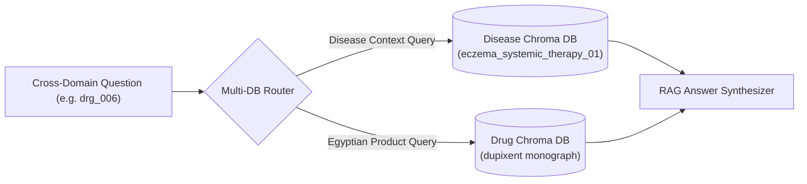

# Clinical Decision-Support RAG System: Question Dataset Evaluation Analysis & Split Report

## 1. Executive Summary

This report provides a comprehensive, evaluation-oriented analysis of the question datasets for the **Clinical Decision-Support RAG System**. The underlying architecture relies on **two separate, domain-specific Chroma vector retrieval systems**:

1. **Drug Retrieval System (`drugs_chroma`)**: Contains **5,978 drug chunks** covering medications, active ingredients, drug classes, indications, contraindications, side effects, precautions, manufacturers, and Egyptian market products.
2. **Disease Retrieval System (`diseases_chroma`)**: Contains **166 disease chunks** covering three primary dermatological conditions: **Eczema (Atopic Dermatitis)**, **Psoriasis**, and **Urticaria (Hives)**.

### Analyzed Datasets
A total of **122 clinical questions** across two source JSON files were analyzed deeply:
- `all_questions_annotated.json`: **97 records** containing rich chunk grounding annotations, rubric focuses, and category metadata.
- `new_questions.json`: **25 records** introducing live weather integration scenarios, edge cases, and expanded multi-hop clinical queries.

### Key Evaluation Split Finding
To evaluate each vector retrieval system independently and fairly without evaluation leakage, questions must be split based on the **semantic knowledge required to retrieve the answer**, rather than entity keyword matching:
- **`DRUG` (9 questions / 7.38%)**: Answer evidence is contained purely in `drugs_chroma`. Used for independent Drug DB evaluation.
- **`DISEASE` (74 questions / 60.66%)**: Answer evidence is contained purely in `diseases_chroma`. Used for independent Disease DB evaluation.
- **`BOTH` (5 questions / 4.10%)**: Cross-domain queries requiring evidence retrieval from **both** DBs (e.g., matching disease treatment guidelines to local Egyptian drug products). Evaluated in a dedicated multi-database suite.
- **`NEITHER` (23 questions / 18.85%)**: Unsupported queries requiring live external weather APIs (8 questions) or out-of-scope medical/pricing knowledge (15 questions). Excluded from vector DB retrieval evaluation.
- **`AMBIGUOUS` (11 questions / 9.02%)**: Vague or under-specified user queries. Excluded from quantitative retrieval evaluation.

---

## 2. Dataset Structure & Schema Comparison

### Schema Breakdown

| Feature / Field | `all_questions_annotated.json` (97 records) | `new_questions.json` (25 records) | Schema Consistency Notes |
| :--- | :--- | :--- | :--- |
| `id` | Present (String, e.g. `ecz_001`, `drg_001`) | Present (String, e.g. `wx_ecz_001`, `ecz_030`) | Unique IDs across both files. Zero overlap. |
| `category` | Present (7 distinct categories) | Present (6 distinct categories) | `live_weather_*` categories only exist in `new_questions.json`. |
| `question` | Present (String) | Present (String) | 122 unique question texts across both datasets. |
| `expected_behavior` | Present (Detailed string) | Present (Detailed string) | High quality clinical expectations in both files. |
| `expected_sections` | Present (List of strings) | Present (List of strings) | Maps to section headings in chunked JSONs. |
| `rubric_focus` | Present (String) | Present (String) | Focuses on Retrieval Quality, Grounding, Architecture, Safety. |
| `source_file` | Present (Single chunk file) | Present (Single or combined source string) | In `new_q`, combined strings like `psoriasis_chunked.json + Open-Meteo` appear. |
| `grounding_status` | Present (`grounded_medical_kb`, `not_grounded`, etc.) | **Missing** | Present only in `all_questions_annotated.json`. |
| `weather_source` | Present (Null in 92, string in 5) | **Missing** | Replaced by `expected_sources` in `new_questions.json`. |
| `target_chunk_ids` | Present (List of chunk ID strings) | **Missing** | Specific chunk IDs provided only in `all_questions_annotated.json`. |
| `supporting_chunks` | Present (List of dicts with citations) | **Missing** | Citations and text snippets provided only in `all_questions_annotated.json`. |
| `notes` | Present (String) | **Missing** | Implementation notes present only in `all_questions_annotated.json`. |
| `evaluation_goal` | **Missing** | Present (8 records) | Present only in a subset of `new_questions.json`. |
| `expected_sources` | **Missing** | Present (8 records) | Present only in live weather records in `new_questions.json`. |

### Data Anomalies & Inconsistencies Identified
1. **Schema Heterogeneity**: `new_questions.json` lacks `target_chunk_ids`, `supporting_chunks`, and `grounding_status`. It introduces `expected_sources` and `evaluation_goal` for only 8 out of 25 records (17 records missing these fields).
2. **Composite Source File Strings**: `new_questions.json` uses non-standard `source_file` strings such as `eczema_atopic_dermatitis_chunked.json + drugs_chunked.json` and `psoriasis_chunked.json + Open-Meteo`.
3. **No ID or Question Collisions**: ID prefixes are cleanly partitioned (`ecz`, `pso`, `urt`, `drg`, `wx`), and zero verbatim duplicate questions exist across the datasets.

---

## 3. Question Taxonomy & Intent Frequencies

Original categories specified across both datasets and their frequency breakdown:



| Category | `all_questions_annotated.json` | `new_questions.json` | Total Count | % of Dataset |
| :--- | :---: | :---: | :---: | :---: |
| `direct_factual` | 25 | 9 | 34 | 27.87% |
| `multi_hop` | 15 | 6 | 21 | 17.21% |
| `out_of_scope` | 15 | 0 | 15 | 12.30% |
| `cross_condition` | 11 | 1 | 12 | 9.84% |
| `ambiguous` | 11 | 0 | 11 | 9.02% |
| `safety_red_flag` | 11 | 0 | 11 | 9.02% |
| `citation_grounding` | 9 | 1 | 10 | 8.20% |
| `live_weather_integration` | 0 | 7 | 7 | 5.74% |
| `live_weather_graceful_failure` | 0 | 1 | 1 | 0.82% |
| **Total** | **97** | **25** | **122** | **100.00%** |

---

## 4. Retrieval Target Distribution

Evaluating the vector databases requires assigning every question to exactly one primary **Retrieval Target**:

```text
                               122 Total Questions
                                        │
        ┌───────────────────┬───────────┴───────────┬───────────────────┐
        ▼                   ▼                       ▼                   ▼
      DRUG               DISEASE                  BOTH            EXCLUDED (34)
   9 (7.38%)           74 (60.66%)              5 (4.10%)         ┌───────┴───────┐
 (Drug DB Eval)     (Disease DB Eval)       (Multi-DB Eval)       ▼               ▼
                                                               NEITHER        AMBIGUOUS
                                                             23 (18.85%)      11 (9.02%)
```

| Retrieval Target | Count | Percentage | Primary Evaluation Role | Description / Criteria |
| :--- | ---: | ---: | :--- | :--- |
| `DRUG` | **9** | **7.38%** | **Evaluate Drug Chroma DB** | Questions where required answer evidence is contained strictly within `drugs_chroma` (active ingredients, drug class, manufacturer, drug safety warnings). |
| `DISEASE` | **74** | **60.66%** | **Evaluate Disease Chroma DB** | Questions where required answer evidence is contained strictly within `diseases_chroma` (symptoms, triggers, disease manifestations, clinical red flags, differential diagnosis). |
| `BOTH` | **5** | **4.10%** | **Cross-Domain Evaluation** | Questions requiring joint evidence retrieval from **both** `drugs_chroma` and `diseases_chroma` (matching disease clinical treatment guidelines with local Egyptian drug products). |
| `NEITHER` | **23** | **18.85%** | **Exclude from Vector RAG** | Questions requiring live external API data (8 weather questions) or out-of-scope knowledge (15 questions with unindexed prices, ungrounded dosages, external conditions). |
| `AMBIGUOUS` | **11** | **9.02%** | **Manual Review / Abstention** | Questions missing necessary entity names or clinical specifics, testing system clarification or abstention logic. |
| **Total** | **122** | **100.00%** | | |

---

## 5. Fine-Grained Intent Distribution

Beyond coarse categories, semantic intent analysis reveals 16 distinct clinical query types:

| Fine-Grained Question Type / Intent | Count | % | Primary Domain | Target DB Assignment |
| :--- | ---: | ---: | :--- | :--- |
| `SYMPTOM_MANIFESTATION` | 24 | 19.67% | Disease | `DISEASE` |
| `OUT_OF_SCOPE_QUERY` | 15 | 12.30% | Out of Scope | `NEITHER` |
| `DIFFERENTIAL_DIAGNOSIS` | 13 | 10.66% | Disease | `DISEASE` |
| `AMBIGUOUS_QUERY` | 11 | 9.02% | Unspecified | `AMBIGUOUS` |
| `EMERGENCY_RED_FLAG` | 11 | 9.02% | Disease / Drug | `DISEASE` (10), `BOTH` (1) |
| `TRIGGER_IDENTIFICATION` | 10 | 8.20% | Disease | `DISEASE` |
| `GROUNDING_VERIFICATION` | 10 | 8.20% | Disease / Drug | `DISEASE` (8), `DRUG` (2) |
| `LIVE_WEATHER_RISK_ASSESSMENT` | 8 | 6.56% | Weather API | `NEITHER` |
| `CROSS_DOMAIN_PRODUCT_LOOKUP` | 4 | 3.28% | Drug + Disease | `BOTH` |
| `ACTIVE_INGREDIENT_LOOKUP` | 4 | 3.28% | Drug | `DRUG` |
| `CONTRAINDICATION_PRECAUTION` | 4 | 3.28% | Drug | `DRUG` |
| `PREGNANCY_SAFETY` | 2 | 1.64% | Drug | `DRUG` |
| `DRUG_CLASS_LOOKUP` | 2 | 1.64% | Drug | `DRUG` |
| `PATHOPHYSIOLOGY_CAUSE` | 2 | 1.64% | Disease | `DISEASE` |
| `MANUFACTURER_LOOKUP` | 1 | 0.82% | Drug | `DRUG` |
| `TRANSMISSION_CONTAGION` | 1 | 0.82% | Disease | `DISEASE` |
| **Total** | **122** | **100.00%** | | |

---

## 6. Retrieval Difficulty Analysis

Questions were classified into three difficulty tiers based on retrieval complexity:
- **`EASY` (40 questions / 32.79%)**: Single-entity direct factual queries or single-chunk citation verifications. High keyword alignment with chunk headers.
- **`MEDIUM` (58 questions / 47.54%)**: Multi-hop queries within a single DB, safety red flags requiring synthesis of multiple warning chunks, or out-of-scope abstention checks.
- **`HARD` (24 questions / 19.67%)**: Multi-database cross-domain retrieval (`BOTH`), cross-condition differential diagnosis across multiple disease entities, or hybrid live API + vector DB reasoning.

### Difficulty Breakdown by Retrieval Target

| Retrieval Target | EASY | MEDIUM | HARD | Total |
| :--- | ---: | ---: | ---: | ---: |
| `DRUG` | 7 | 2 | 0 | **9** |
| `DISEASE` | 33 | 29 | 12 | **74** |
| `BOTH` | 0 | 0 | 5 | **5** |
| `NEITHER` | 0 | 16 | 7 | **23** |
| `AMBIGUOUS` | 0 | 11 | 0 | **11** |
| **Total** | **40** | **58** | **24** | **122** |

---

## 7. Entity Analysis

Entity extraction identified the distribution of drug and disease entities across the question set:

| Entity Composition | Question Count | % of Dataset | Primary Retrieval Target |
| :--- | ---: | ---: | :--- |
| **Single Disease Entity** (e.g. Eczema only, Psoriasis only) | 62 | 50.82% | `DISEASE` (58), `NEITHER` (4) |
| **Multiple Disease Entities** (e.g. Eczema vs Psoriasis) | 16 | 13.11% | `DISEASE` (16) |
| **Single Drug Entity** (e.g. Dupixent, Hostacortin) | 11 | 9.02% | `DRUG` (7), `NEITHER` (4) |
| **Multiple Drug Entities** (e.g. Methotrexate vs Prednisone) | 3 | 2.46% | `DRUG` (2), `NEITHER` (1) |
| **Both Drug & Disease Entities** (e.g. Dupilumab + Eczema + Egyptian Market) | 12 | 9.84% | `BOTH` (5), `DISEASE` (4), `NEITHER` (3) |
| **No Specific Medical Entity** (Ambiguous / Weather location only) | 18 | 14.75% | `AMBIGUOUS` (11), `NEITHER` (7) |
| **Total** | **122** | **100.00%** | |

> [!NOTE]
> Questions containing both a drug and a disease entity (12 total) were **not** automatically classified as `BOTH`. Only 5 of them require evidence from both vector databases. The remaining 7 were assigned to `DISEASE` or `NEITHER` based on which database contains the required ground-truth evidence.

---

## 8. Cross-Domain (`BOTH`) Analysis

The 5 questions classified as `BOTH` represent true multi-database retrieval requirements:



### Detailed Inventory of `BOTH` Questions

1. **`drg_006`**: *"My dermatologist mentioned dupilumab for my eczema — what is it, and is it available as a specific product I could ask my pharmacist about in Egypt?"*
   - **Disease DB Requirement**: Retrieve indication and systemic therapy context for eczema (`eczema_systemic_therapy_01`).
   - **Drug DB Requirement**: Retrieve Egyptian brand product containing dupilumab (`dupixent`).
2. **`drg_007`**: *"For urticaria, what's the first-line antihistamine treatment, and are there Egyptian-market products with that ingredient?"*
   - **Disease DB Requirement**: Retrieve first-line therapy guidelines for urticaria (`urticaria_first_line_therapy_01`).
   - **Drug DB Requirement**: Search active ingredient index for Egyptian antihistamine products.
3. **`drg_014`**: *"I'm on methotrexate for my psoriasis and now I have a fever and feel extremely unwell — should I just wait it out?"*
   - **Disease DB Requirement**: Retrieve psoriatic severe emergency warning (`psoriasis_when_to_see_doctor_04`).
   - **Drug DB Requirement**: Retrieve methotrexate infection risk and immunosuppression warning (`methotrexate`).
4. **`drg_018`**: *"My doctor prescribed tacrolimus ointment for my eczema — what is it, and is there a product with that active ingredient available in Egypt?"*
   - **Disease DB Requirement**: Retrieve topical calcineurin inhibitor indication context for eczema.
   - **Drug DB Requirement**: Search Drug DB for topical tacrolimus formulations in Egypt (e.g., `adport`, `tarolimus`).
5. **`drg_019`**: *"I have chronic hives and my doctor mentioned prednisone as a short-term bridge — what does the knowledge base say about that drug class, and does the Egyptian drug database have a prednisone product?"*
   - **Disease DB Requirement**: Retrieve short-term corticosteroid bridge protocol for chronic hives.
   - **Drug DB Requirement**: Retrieve drug class information and local brand products for prednisone (e.g., `hostacortin`).

---

## 9. Dataset Quality & Evaluation Leakage Analysis

### Identified Risks & Mitigations

1. **Weather API Dependency (`NEITHER`)**:
   - *Issue*: 8 questions (`wx_ecz_001`–`wx_urt_002`, `wx_missing_001`) depend on Open-Meteo live API data.
   - *Evaluation Leakage Risk*: Evaluating vector search on these questions will artificially depress retrieval recall, because live humidity/temperature values do not exist in Chroma DB.
   - *Mitigation*: Placed in `evaluation_questions/excluded/unsupported_questions.json`.
2. **Out-of-Scope Queries (`NEITHER`)**:
   - *Issue*: 15 questions ask for real-time drug prices in EGP, specific ungrounded mg/kg dosages, or unindexed conditions (e.g., lupus).
   - *Evaluation Leakage Risk*: Vector DB retrieval cannot succeed because ground-truth answers are missing from indexed documents.
   - *Mitigation*: Placed in `evaluation_questions/excluded/unsupported_questions.json` to evaluate system **abstention**, not retrieval recall.
3. **Ambiguous Queries (`AMBIGUOUS`)**:
   - *Issue*: 11 questions lack entity names (e.g., *"Is this cream good for me?"*).
   - *Mitigation*: Placed in `evaluation_questions/excluded/ambiguous_questions.json` for testing clarification prompts.
4. **Keyword Over-Matching Risk**:
   - *Issue*: Questions mentioning "psoriasis" or "eczema" inside drug questions could pollute Disease DB evaluation if filtered by string matching.
   - *Mitigation*: Enforced semantic target assignment (`retrieval_target`) rather than entity matching.

---

## 10. Recommended Evaluation Split Plan

The output files have been generated in `evaluation_questions/` according to the following clean directory structure:

```text
evaluation_questions/
├── all_classified_questions.json          (Master dataset: 122 questions)
│
├── drug/                                  (Drug Vector DB Evaluation Suite)
│   ├── drug_questions.json               (9 questions)
│   ├── drug_easy.json                    (7 questions)
│   ├── drug_medium.json                  (2 questions)
│   └── drug_hard.json                    (0 questions)
│
├── disease/                               (Disease Vector DB Evaluation Suite)
│   ├── disease_questions.json            (74 questions)
│   ├── disease_easy.json                 (33 questions)
│   ├── disease_medium.json               (29 questions)
│   └── disease_hard.json                 (12 questions)
│
├── cross_domain/                          (Multi-Database Evaluation Suite)
│   └── both_questions.json               (5 questions)
│
└── excluded/                              (Non-Retrieval Evaluation Suites)
    ├── ambiguous_questions.json          (11 questions)
    └── unsupported_questions.json        (23 questions)
```

---

## 11. Recommended Metadata Schema

Every generated JSON record in `evaluation_questions/` follows this standardized schema:

```json
{
  "question_id": "drg_006",
  "source_file": "all_questions_annotated.json",
  "question_text": "My dermatologist mentioned dupilumab for my eczema — what is it, and is there a product with that active ingredient available in Egypt?",
  "primary_domain": "DRUG",
  "secondary_domain": "DISEASE",
  "retrieval_target": "BOTH",
  "question_type": "CROSS_DOMAIN_PRODUCT_LOOKUP",
  "intent": "Requires dupilumab indication context + Egyptian product lookup.",
  "entities": {
    "drugs": ["dupilumab"],
    "diseases": ["eczema"]
  },
  "drug_entities": ["dupilumab"],
  "disease_entities": ["eczema"],
  "expected_knowledge_type": "Multi-Database (Disease Clinical Guidelines + Drug Local Products)",
  "requires_drug_db": true,
  "requires_disease_db": true,
  "requires_multi_db_retrieval": true,
  "is_answerable_from_current_system": true,
  "ambiguity_level": "LOW",
  "classification_reason": "Cross-domain query: requires retrieving disease guidelines/indications from Disease KB AND local product availability/warnings from Drug KB.",
  "confidence": 0.98,
  "retrieval_difficulty": "HARD",
  "original_category": "multi_hop",
  "original_source_file": "drugs_chunked.json",
  "rubric_focus": "Retrieval Quality",
  "grounding_status": "grounded_multi_source",
  "expected_sections": ["Systemic Therapy", "Products"],
  "target_chunk_ids": ["eczema_systemic_therapy_01", "dupixent"]
}
```

---

## 12. Final Recommendations & Summary Table

### Final Recommendations

1. **Independent Drug DB Benchmark**: Use `evaluation_questions/drug/drug_questions.json` (9 questions) to compute Recall@K, Precision@K, and MRR for `drugs_chroma`.
2. **Independent Disease DB Benchmark**: Use `evaluation_questions/disease/disease_questions.json` (74 questions) to compute Recall@K, Precision@K, and MRR for `diseases_chroma`.
3. **Cross-Domain Pipeline Benchmark**: Use `evaluation_questions/cross_domain/both_questions.json` (5 questions) to evaluate the dual-retrieval routing logic and multi-vector-store fusion.
4. **Abstention & Safety Benchmark**: Use `evaluation_questions/excluded/unsupported_questions.json` (23 questions) and `evaluation_questions/excluded/ambiguous_questions.json` (11 questions) to evaluate guardrails, refusal mechanisms, and user clarification prompting.

### Final Evaluation Summary Table

| Retrieval Target | Count | Percentage | Recommended Evaluation Use | Primary Target Vector Store |
| :--- | ---: | ---: | :--- | :--- |
| **`DRUG`** | **9** | **7.38%** | **Evaluate Drug Chroma DB** | `data/vectorstores/drugs_chroma` |
| **`DISEASE`** | **74** | **60.66%** | **Evaluate Disease Chroma DB** | `data/vectorstores/diseases_chroma` |
| **`BOTH`** | **5** | **4.10%** | **Cross-domain multi-DB evaluation** | Both Chroma Vector Stores |
| **`NEITHER`** | **23** | **18.85%** | **Abstention / External API evaluation** | Excluded from Chroma Vector Retrieval |
| **`AMBIGUOUS`** | **11** | **9.02%** | **Clarification prompt evaluation** | Excluded from Chroma Vector Retrieval |
| **Total** | **122** | **100.00%** | **Complete Dataset Accounting** | |
